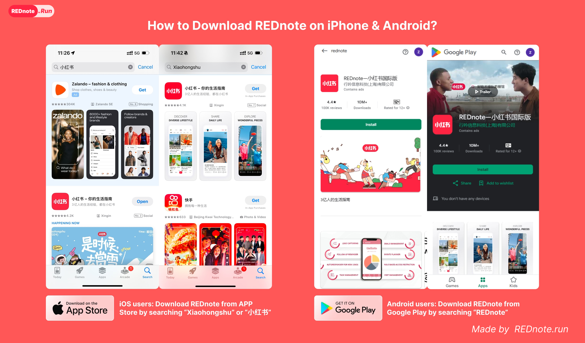
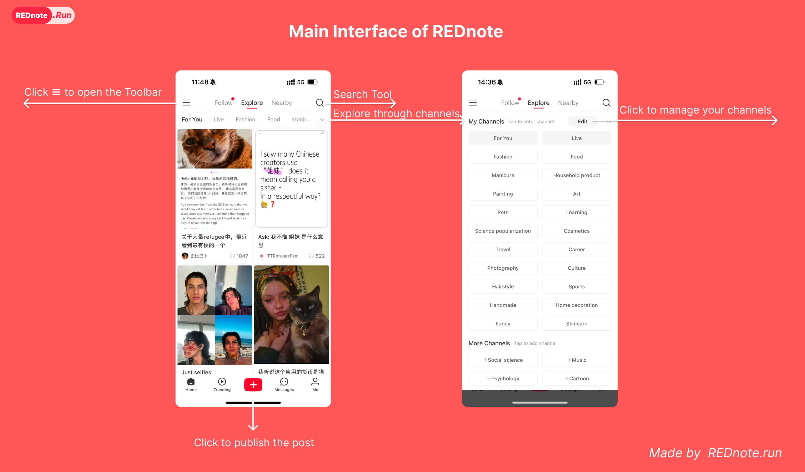
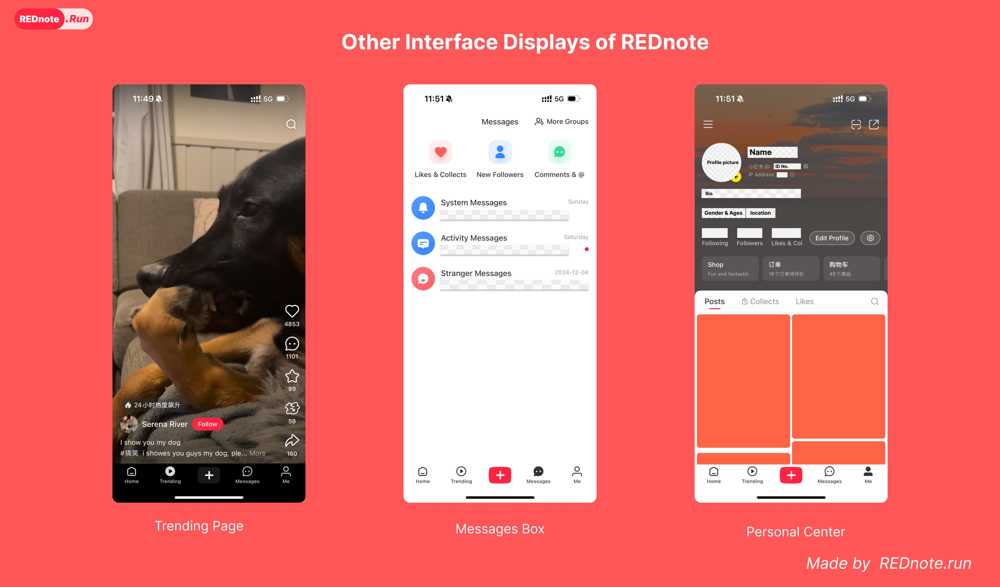
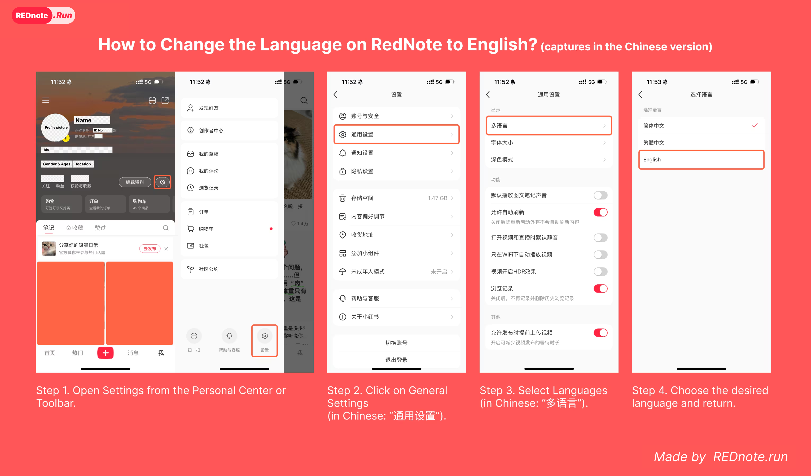
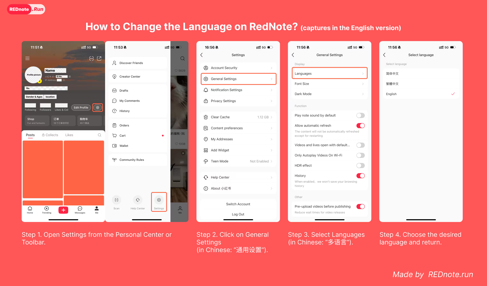
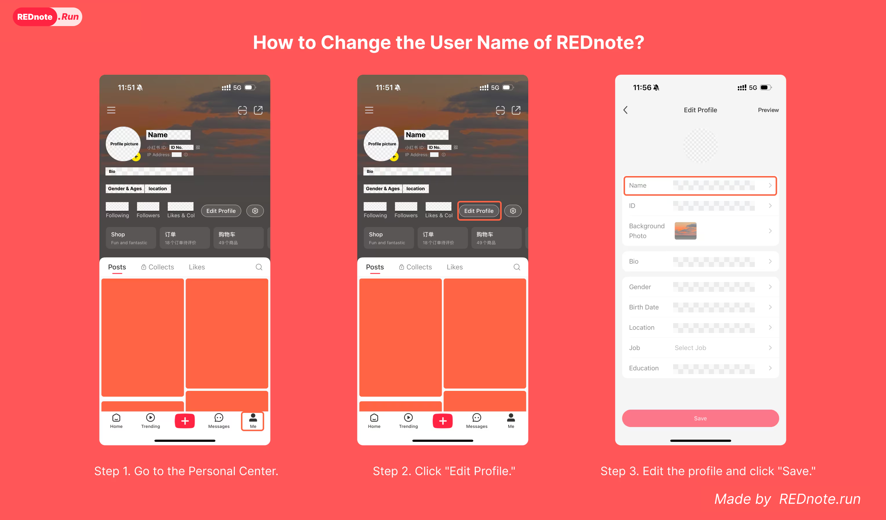
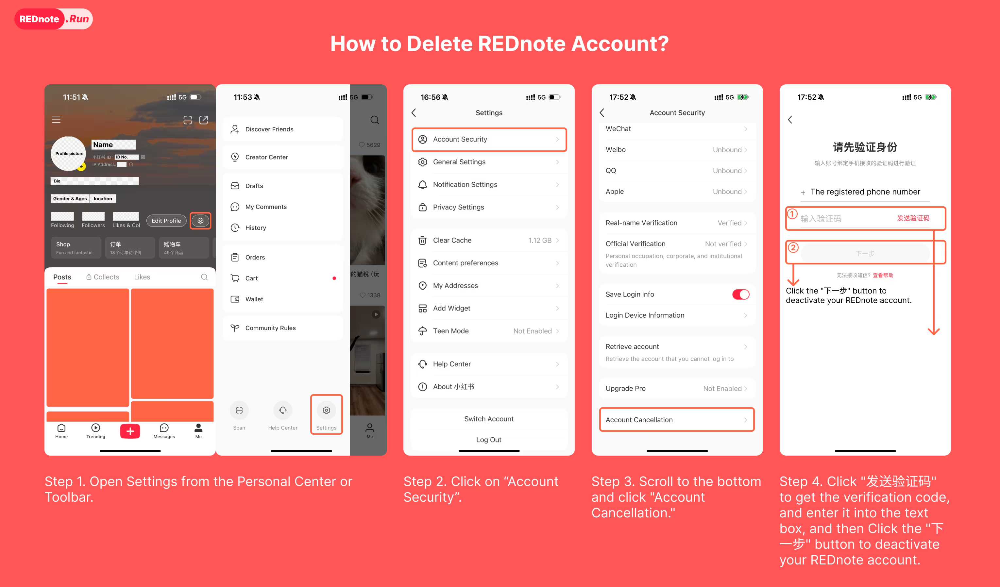
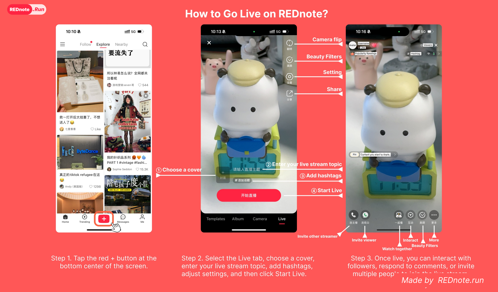
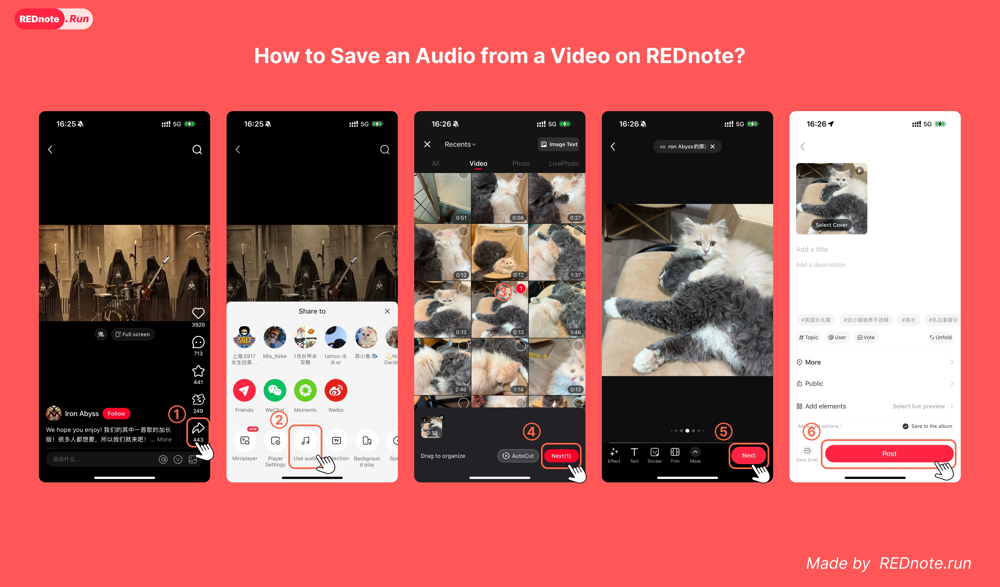

# TikTok to REDnote: Your Complete Migration Guide

Wanna level up your content game? TikTok's future in the US is shaky. So, lots of creators, or "TikTok refugees," are checking out REDnote, aka xiaohongshu. It's China's hot content hub with over 200 million users. If you want to grow your audience or find a new place to create, this guide's got you. It covers saving your TikTok stuff and getting big on xiaohongshu. Let's tap into your potential on China's top lifestyle platform!

> "As a TikTok refugee myself, discovering REDnote was a game-changer. The platform's emphasis on quality content and authentic engagement offers a refreshing alternative to traditional social media." - Sarah Chen, Lifestyle Creator

## Table of Contents
- [When Will TikTok Be Banned?](#when-will-tiktok-be-banned)
- [How Do I Delete All My Videos on TikTok at Once?](#how-do-i-delete-all-my-videos-on-tiktok-at-once)
- [What is REDnote?](#what-is-rednote-and-is-it-the-chinese-version-of-tiktok)
- [How to Translate REDnote Posts?](#how-to-translate-rednote-posts-into-different-languages)
- [How to Use REDnote?](#how-to-use-rednote)
- [Navigating REDnote in English](#navigating-rednote-in-english)
- [Managing Your REDnote Account](#managing-your-rednote-account)
- [How to Go Live?](#how-to-go-live-on-rednote)
- [How to Save Audio from Video?](#how-to-save-an-audio-from-a-video-on-rednote)
- [How to Delete Account?](#how-to-delete-your-rednote-account)

## When Will TikTok Be Banned?

If ByteDance doesn't sell TikTok by January 19, 2025, it's banned in the US. If you download it before then, it stays on your device. But you won't find it in the app store or update it after January 19.

## How Do I Delete All My Videos on TikTok at Once?

Alright, let's get into managing your TikTok content. Tough luck: TikTok doesn't let you delete all your videos at once right now. You gotta do it the old-fashioned way—manually, one by one. Here's how:

1. Head to your profile and tap the video you wanna delete.
2. Select the three dots (…) on the right to open the Options Menu.
3. Scroll down, find the Delete option, give it a click, and your video will be deleted.

### Alternative: Deactivate Your Account

1. Open your profile
2. Tap the menu (☰) button at the top
3. Go to Settings and Privacy
4. Tap Account, then pick Deactivate or delete the account, and follow the instructions

## What is REDnote, and is It the Chinese Version of TikTok?

REDnote (also known as xiaohongshu) is China's premier lifestyle and content platform, combining social media, e-commerce, and community engagement in one powerful ecosystem. With a bunch of Gen Z creators on REDnote, it's turned into the top spot for real content and solid connections. As more TikTok refugees join the platform, REDnote has evolved to become a truly global community for creative expression and lifestyle sharing.

### Why Creators Love REDnote

REDnote isn't just another TikTok alternative - it's a comprehensive platform that can take your content creation to the next level. Here's what makes it special:

#### Content Strategy
- **REDnote**: Focus on high-quality, informative content that combines photos, videos, and detailed descriptions. Perfect for tutorials, reviews, and lifestyle content. Many Chinese use REDnote as a search engine for their favorite content
- **TikTok**: Quick, entertaining videos optimized for viral moments.

#### Audience Engagement
- **REDnote**: Engaged community that actively searches for specific content and values expertise
- **TikTok**: Algorithm-driven discovery focused on entertainment

#### Monetization Opportunities
- **REDnote**: Multiple revenue streams through e-commerce integration, brand collaborations, and affiliate marketing
- **TikTok**: Primarily focused on creator fund and sponsored content

## How to Translate REDnote Posts into Different Languages?

Since REDnote doesn't provide a built-in translation tool, we've developed **rednote.run** - a comprehensive toolkit specifically designed for TikTok creators transitioning to REDnote. Our platform offers powerful translation features to help you overcome language barriers.

### Why Choose rednote.run?
- **Smart Translation**: Instantly translate posts, comments, and videos from Chinese to English
- **Creator-Focused Tools**: Specially designed for content creators moving from TikTok to REDnote
- **Free & User-Friendly**: Access all essential tools without any cost
- **Community Support**: Join a growing community of international creators succeeding on REDnote

Visit [rednote.run](https://rednote.run) to access your complete REDnote toolkit and start creating content that resonates with your new audience.

## How to Use REDnote?

Getting started on REDnote is straightforward, but success requires understanding the platform's unique features. Here's your step-by-step guide to becoming a REDnote creator:

### Download and Setup
- Android users: Download from [Google Play](https://play.google.com/store/apps/details?id=com.xingin.xhs)
- iOS users: Find it in the [App Store](https://apps.apple.com/app/id741292507) under "Xiaohongshu" or "小红书"

### Account Creation Tips
- Choose a professional username that reflects your content niche
- Complete your profile with a high-quality photo and detailed bio
- Link your social media accounts for better discoverability

### Publish and view Post
To give you a clearer picture of REDnote, we've added screenshots of the app's main screens.

1. **Main Interface**
   

2. **Post Interfaces**
   

3. **Other Interfaces**
   

### Pro Tips for Content Creation
- Post consistently (3-4 times per week minimum)
- Engage with your community daily
- Study trending topics in your niche
- Use [rednote.run](https://rednote.run) - the essential toolkit for TikTok refugees
- Connect with other international creators on the platform

## Navigating REDnote in English

Making REDnote accessible for international creators is crucial. Here's how to optimize your experience:

### Setting Up English Language
1. Open Settings from the Personal Center or Toolbar
2. Tap General Settings (Chinese: "通用设置")
3. Tap Languages (Chinese: "多语言")
4. Choose English and return

## Managing Your REDnote Account

### Profile Customization
1. Click "My" to enter the Personal Center
2. Click "Edit Profile"
3. Optimize your profile:
   - Choose a catchy username
   - Write an engaging bio
   - Add your expertise areas
   - Link your social media

### Account Security
- Enable two-factor authentication
- Regularly update your password
- Monitor account activity
- Back up important content

### Account Deactivation (If Needed)
1. Open Settings from the Personal Center
2. Click "Account Security"
3. Scroll to "Account Cancellation"
4. Click "发送验证码" for verification code
5. Enter the code and click "下一步" (Next)

**Important**: Before deactivating:
- Save all your content
- Inform your followers
- Complete any pending transactions
- Download your data

## How to Go Live on REDnote?

Wanna share your story with more REDnote folks? Just start a live stream. Here's how to go live on REDnote:
1. Tap the red + button at the bottom center.
2. Pick the Live tab.
3. Choose a cover and type in your live stream topic.
4. Add in some hashtags and tweak the settings.
5. Click Start Live.

**Note**: Currently, REDnote requires real-name verification with a Chinese ID card for live streaming. Without this ID, you can only participate as a viewer.

## How to Save an Audio from a Video on REDnote?

Truth is, you can't just pull audio from a REDnote video straight to your phone. But you can put the audio you want onto your video using REDnote, put the video out there, and then stash the finished video on your device. Here's the scoop on using REDnote's audio for your vid:
1. Open the video post with the desired audio
2. Tap the Share button at the bottom-right
3. Swipe left to find the Music icon
4. Record or select a video with the chosen audio
5. Edit your video (effects, subtitles, etc.)
6. Add details and post

### Tips
- Use the Download button (Save to Album) to download videos directly
- Enable "Save to Album" before posting to save locally
- Check Advanced Options for quality settings and scheduled posting

## How to Delete Your REDnote Account?

1. Open Settings from the Personal Center
2. Click "Account Security"
3. Scroll to "Account Cancellation"
4. Click "发送验证码" for verification code
5. Enter the code and click "下一步" (Next)

**Important**: Back up all important data before proceeding!

## Your Next Steps as a REDnote Creator

As the TikTok situation evolves and more creators seek new platforms, REDnote presents an exciting opportunity to be part of a growing global community. Join the thousands of TikTok refugees who have already found success on this dynamic platform. Here's your action plan to get started:

1. **Set Up Your Foundation**
   - Download REDnote and create your account
   - Use rednote.run to set up English language support
   - Complete your profile with professional details

2. **Start Creating Content**
   - Begin with your most successful TikTok content formats
   - Adapt your style to REDnote's preference for detailed, informative content
   - Experiment with different post types (photos, videos, articles)

3. **Build Your Community**
   - Engage with similar creators in your niche
   - Respond to comments and build relationships
   - Use relevant hashtags to increase visibility

4. **Optimize and Grow**
   - Monitor your analytics through rednote.run
   - Adjust your strategy based on performance
   - Stay updated with platform trends

### Ready to Start?
Visit [rednote.run](https://rednote.run) to access your complete toolkit and join our community of successful international creators on REDnote. Whether you want to grow your audience or find a new spot for your content, we're here to help you succeed.

Remember: The key to success on REDnote is authenticity, consistency, and quality. Take your time to get to know the platform, chat with the community, and make content that's really useful for your audience.

Welcome to your next creative chapter! 🚀